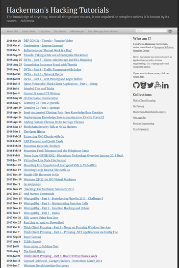

# Hugo-Octopress <!-- omit in toc -->
Hugo-Octopress is a port of the classic [Octopress][octopress-link] theme to [Hugo][hugo-link].

Live demo using the unmodified theme:

* [http://hugo-octopress-test.s3-website-us-east-1.amazonaws.com/](http://hugo-octopress-test.s3-website-us-east-1.amazonaws.com/).
* Source: [https://github.com/parsiya/Hugo-Octopress-Test](https://github.com/parsiya/Hugo-Octopress-Test).

My personal website uses the compact index (see below):

* [https://parsiya.net](https://parsiya.net).
* Source: [https://github.com/parsiya/parsiya.net](https://github.com/parsiya/parsiya.net)

## Contents <!-- omit in toc -->
- [Configuration](#configuration)
- [Code highlight](#code-highlight)
- [Markdown options](#markdown-options)
- [CSS override](#css-override)
- [Navigation menu](#navigation-menu)
- [Sidebar](#sidebar)
  - [Sidebar text](#sidebar-text)
  - [Social network icons](#social-network-icons)
  - [Sidebar menu](#sidebar-menu)
  - [Recent posts](#recent-posts)
- [Shortcodes](#shortcodes)
  - [Code caption](#code-caption)
  - [Image caption](#image-caption)
- [Pages](#pages)
  - [License page](#license-page)
  - [Not Found or 404.html](#not-found-or-404html)
  - [Taxonomy pages](#taxonomy-pages)
  - [Individual pages](#individual-pages)
- [Table of contents](#table-of-contents)
- [Disqus](#disqus)
- [Twitter Card](#twitter-card)
- [Compact Index](#compact-index)
- [mainSections](#mainsections)
- [Troubleshooting](#troubleshooting)
  - [Hugo page summary bug](#hugo-page-summary-bug)
  - [Empty Posts Link on Homepage](#empty-posts-link-on-homepage)
- [Issues/TODO](#issuestodo)
- [Attribution](#attribution)
- [Ported by](#ported-by)
- [Theme license](#theme-license)


## Configuration
Hugo-Octopress can be configured by modifying the parameters in the [configuration file](https://gohugo.io/overview/configuration/). A working config file `sample-config.toml` is provided. Some miscellaneous parameters are explained below:

``` toml
baseurl = "http://example.com"
disablePathToLower = false
languageCode = "en-us"
title = "Site title"
theme = "hugo-octopress"

# Disqus shortcode
# Disable comments for any individual post by adding "comments: false" in its frontmatter
disqusShortname = "Your disqus shortname"

# Number of blog posts in each pagination page
paginate = 6

[permalinks]
# Configures post URLs
post = "/blog/:year-:month-:day-:title/"

[params]

  # If false, all contents of posts will appear on the front page and in pagination
  truncate = true

  # Author's name (appears in meta tags and under posts)
  author = "Author's name"

  # This text appears in site header under website title
  subtitle = "Subtitle appears under website title"

  # Search engine URL
  searchEngineURL = "https://www.google.com/search"

  # Text of the "Continue Reading" label. Supports markdown and inline HTML.
  # For example, &rarr; == right arrow.
  continueReadingText = "Would you like to know more? &rarr;"

  # Google analytics code - remove if you do not have/want Google Analytics - needs JavaScript
  googleAnalytics = "UA-XXXXX-X"

  # Optional piwik tracking
  #[params.analytics.piwik]
  #  URL = "https://stats.example.com"
  #  ID = "42"

  # Switch to true to enable RSS icon link
  rss = true

  # Set to true to use a text label for RSS instead of an icon
  # This is overwritten by the "rss" setting
  textrss = false

  # Website's default description
  description = ""

  # Populate with your search keywords - these will appear in meta tags
  # defaultKeywords = ["keyword1" , "keyword2" , "keyword3" , "keyword4"]

  # Set to true to hide ReadingTime on posts
  disableReadingTime = false

  # Set to true to disable downloading of remote Google fonts
  disableGoogleFonts = false

  # Remove or set to false to use local fonts
  remoteFonts = false

  # Remove or set to false to use FontAwesome CDN, otherwise, the theme uses ForkAwesome local fonts.
  # fontAwesome = false
```

## Code highlight
This theme uses the built-in [Chroma](https://github.com/alecthomas/chroma) highlighter with the `solarized-dark` theme. See all supported styles at [https://xyproto.github.io/splash/docs/all.html](https://xyproto.github.io/splash/docs/all.html).

Some options to control code highlighting:

``` toml
# Highlight shortcode and code fences (```) will be treated similarly
pygmentscodefences = true

# Change highlight style here.
# Full list: https://xyproto.github.io/splash/docs/all.html
pygmentsStyle = "solarized-dark"

# Add other Chroma options here (override them in the highlight shortcode inside markdown)
# List of supported options: https://gohugo.io/content-management/syntax-highlighting/#options
# For example: pygmentsoptions = "linenos=true"
```

For more information see [Syntax Highlighting](https://gohugo.io/extras/highlighting/) in Hugo's documentation.

## Markdown options
Blackfriday is Hugo's markdown engine. For a complete list of options see [Configure Blackfriday rendering](https://gohugo.io/getting-started/configuration/#configure-blackfriday-rendering). Blackfriday options can be set as follows:

``` toml
[blackfriday]
  hrefTargetBlank = true # open external links in a new window
  fractions = false
```

## CSS override
You can override the built-in CSS and add your own. Put your CSS files in the `static` directory of your website. While storing them inside the `themes/Hugo-Octopress/static` directory works, it's not recommended (keep your website and theme as separated as possible to be able to switch themes easily). Then modify the `customCSS` parameter. The path should be relative to the `static` folder. These CSS files will be added through the `header` partial after the built-in CSS file.

For example, if custom CSS files are `static/css/custom.css` and `static/css/custom2.css` then `customCSS` will look like this:

``` toml
[params]
  customCSS = ["css/custom.css","css/custom2.css"]
```

## Navigation menu
Links in the navigation menu (everything other than Google search and RSS icon) can be customized. The navigation menu is generated using the `layouts/partials/navigation.html` partial.

By default, navigation menu links will open in the same window. You can change this behavior by setting the `navigationNewWindow` parameter to true. Links to root ("/") will always open in the same window. Currently, Hugo does not support adding custom attributes to menus.

Links are sorted according to weight from left to right. For example, a link with weight of `-10` will appear to the left of links with weights `0` or `10`. Links can be added to the config file:

``` toml
[[menu.main]]
  Name = "Blog"
  URL = "/"
  weight = -10

[[menu.main]]
  Name = "The other guy from Wham!"
  URL = "https://www.google.com/search?q=andrew+ridgeley"
  weight = -5

[[menu.main]]
  Name = "This theme - add link"
  URL = "https://www.github.com"

[params]
  # If set to true, navigation menu links will open in a new window with the exception of links to root ("/")
  # If this item does not exist or is set to false, then navigation menu links will open in the same window
  navigationNewWindow = true
```

Search engine customization:

``` toml
[params]
  searchEngineURL = "https://www.google.com/search"
```

## Sidebar
The sidebar has four sections, from top to bottom:

* Sidebar header and text (optional).
* Social network icons (optional): Icons and links to Github, Bitbucket, and more.
* Sidebar menu (optional): Links in sidebar.
* Recent posts: Displays last X posts (default is 5).

The sidebar is generated using the partial at `layouts/partials/sidebar.html`.

### Sidebar text
The sidebar text has two parts and both can be configured. Both are passed to `markdownify` so you can use markdown (e.g. add links or new lines).

* Sidebar header appears first in an `<h1>` tag. It can be configured with `sidebarHeader`.
* Sidebar text appears under the header and is in `sidebarText`.

Add new lines with `</br>` or using markdown (two spaces at the end of a line or one empty line in between two paragraphs). When adding two spaces, remember to remove the indentation at the start of the new line otherwise the it will be treated as a codeblock.

``` toml
sidebarHeader = "Sidebar Header"

sidebarText = """Here's a [link to google](https://www.google.com)
</br>
Second line
</br>
Third line
This line has two spaces in the end to create a new line using markdown[two spaces here]  
Forth line
"""
```

### Social network icons
Sidebar social network icons are configured as follows:

``` toml
[params]
  github = "https://github.com/parsiya/"
  bitbucket = "https://bitbucket.org/parsiya/"
  gitlab = "https://gitlab.com/parsiya"
  twitter = "https://twitter.com/cryptogangsta/"
  keybase = "https://keybase.io/parsiya/"
  linkedin = "https://www.linkedin.com/in/parsiya/"
  stackoverflow = ""
  googleplus = ""
  youtube = ""
  facebook = ""
  instagram = ""
  bitcoin = ""
```

Icon sequence is unfortunately hardcoded. To modify, copy `your-website/themes/Hugo-Octopress/layouts/partials/sidebar.html` to `your-website/layouts/partials/sidebar.html` and modify the sequence. Look for `<li class="sidebar-nav-item">` tags. Add a `</br>` tag to create a new line.

Code to display links (and the idea to use these icons) is from [Hyde-x](https://github.com/zyro/hyde-x/).

Icons are from [Font Awesome](https://fontawesome.com/) and [Fork Awesome](https://github.com/ForkAwesome/Fork-Awesome). To use icons with square dark backgrounds add `-square`. For example `<i class="fa fa-twitter-square fa-3x"></i>`. Size can be from 1 to 5 use `fa-lg` to make them adaptive.

### Sidebar menu
This menu can be enabled by setting `sidebarMenuEnabled` to `true`. It has two parts:

* A header that appears inside the `<h1>` tag on top. It can be set by `sidebarMenuHeader`. This part only supports text.
* A series of links. They can be configured similar to navigation menu items by using the `[[menu.sidebar]]` tag. Set `sidebarNewWindow` to `true` to open these links in a new window

``` toml
[[menu.sidebar]]
  Name = "Google"
  URL = "https://www.google.com"
  weight = 0

[[menu.sidebar]]
  Name = "Hugo"
  URL = "/categories/hugo/"
  weight = 1
```

### Recent posts
Last x posts can be displayed in the sidebar. This number is controlled by `sidebarRecentLimit`. To hide this section you can remove `sidebarRecentLimit` from the config file or set it to zero.

## Shortcodes
Creating [shortcodes](https://gohugo.io/extras/shortcodes/) in Hugo was surprisingly easy (and one of the reasons I switched to it). I recreated two plugins from Octopress. They add captions to code blocks and images. These shortcodes are in `layouts/shortcodes/`.

For all my Hugo shortcodes see [https://github.com/parsiya/Hugo-Shortcodes](https://github.com/parsiya/Hugo-Shortcodes).

### Code caption
This shortcode adds a caption to codeblocks. The codeblock is wrapped in a `<figure>` tag and caption is added using `<figcaption>`. It has two parameters, `title` which is the caption of the code block and `lang` which is the language that is passed to the Hugo's `highlight` function along with `linenos=true` to enable line numbers.

Usage and source (parameters are named and not positional):

``` html

<figure class="code">
  <figcaption>
    <span>{{ .Get "title" }}</span>
  </figcaption>
  <div class="codewrapper">
    {{ highlight .Inner (.Get "lang") "linenos=true" }}
  </div>
</figure>

```

And will look like:

.

If the code inside the tag overflows, a horizontal sidebar will be added to the table. It took me a while to achieve this as the `highlight` function created tables that were out of my control. The output from `highlight` is wrapped in `<div class="codewrapper">` and the scroll bar will be added for the whole `div`. The following in the CSS file (starting from line 2225) enables this behavior:

``` css
div.codewrapper {
    overflow-x: auto;
    overflow-y: hidden;
    background-color: #002B36;
}
```

### Image caption
This shortcode adds captions to pictures. Due to the way the original CSS file was organized, this shortcode does not use `<figure>` and `<figcaption>`. `Alt` tag is also set to `title`.

Usage (parameters are named and not positional):

``` go

```

Results in:

``` html
<span class="caption-wrapper">
  
  <span class="caption-text">Sample caption</span>
</span>
```

## Pages
This section discusses the different kind of pages that are supported by the theme.

### License page
License page address is `baseurl/license/`. Create a markdown file containing the text for the license page under `content` and set its type to `license` in frontmatter:

``` yaml
---
title: "License"
type: license
---

License text
```

License page template is: `layouts/license/single.html`.

### Not Found or 404.html
The `404.html` page has two optional parameters and both support markdown:

* `notFoundHeader`: 404 page title
* `notFoundText`: 404 page text

If they are not set in the config file, theme's default page is used (`layouts/404.html`).

### Taxonomy pages
You can create taxonomy lists (e.g. categories and tags). Set `generateTaxonomyList = true` to get generate them at `baseURL/tags/` and `baseURL/categories`. By default items are sorted by count. `sortTaxonomyAlphabetical = true` changes the sort to alphabetical.

``` toml
[Params]
  generateTaxonomyList = true

  # Alphabetical sort
  # sortTaxonomyAlphabetical = true
```

To revert, remove `sortTaxonomyAlphabetical` or set it to false.

Note: As of Hugo 0.33, `indexes` has been removed. If your taxonomy pages are not rendered, please update to the latest version of Hugo. Templates are now at:

* `/layouts/category/category.html`
* `/layouts/tag/tag.html`

### Individual pages
Individual pages can be created in two ways:

* Create a new content file in `content/page`.
* Create a page anywhere inside `content` and set the type `page` in frontmatter. E.g. `type: page`.

The template for individual pages is at `Hugo-Octopress/layouts/page/single.html`. It can be overridden by a file in the website's `layouts/page/single.html`. For more information see [Single Page Templates in Hugodocs](https://gohugo.io/templates/single-page-templates/).

## Table of contents
You can add `Table of Contents (ToC)` to pages. The ToC is on top of the actual page and does not appear in the summary. You can also use various editor plugins to manually create them inside your markdown files.

Customize ToC either globally or for each page:

1. Add a variable named  `toc` to the frontmatter of the post/page and set it to `true`.

    ``` yaml
    title: "title"
    date: 2016-04-01T20:22:37-04:00
    draft: false
    toc: true
    ```

2. Enable it globally by setting `tableOfContents` under `[Params]` to `true`.

    ``` toml
    [Params]
      tableOfContents = true
    ```

The `toc` variable in the frontmatter has priority. If it is set to `false` the global setting is ignored.

## Disqus
Hugo supports Disqus. Note Disqus shortname is directly in the config file (and not under `params`):

``` toml
disqusShortname = "whatever"
```

By default, Disqus is not enabled on localhost using `hugo serve`. This can be disabled (e.g. if you want to test Disqus locally) by commenting the `if and return` lines in the Disqus partial in `layouts/partials/disqus.html`.

## Twitter Card
Twitter card support can be enabled in the config file under `Params`:

``` toml
[params]
  # Twitter card config
  # Enable.
  twitterCardEnabled = true
  # Don't include the @.
  # twitterCardSite = 
  twitterCardDomain = "parsiya.net"
  # Don't include the @.
  twitterCardAuthor = "CryptoGangsta"
```

After Twitter card is enabled, you can add summary images to your posts in front matter with `twitterImage`:

``` yaml
twitterImage: 02-fuzzer-crash.png
```

**Note:** Image URL should be relative to the page, otherwise the final URL will not be correct. In short, image URL should be part of the page bundle. In this case, both `index.md` and `02-fuzzer-crash.png` are in the same root directory. If the image is in a subdirectory of page bundle, it can be added like this:

``` yaml
twitterImage: images/02-fuzzer-crash.png
```

The template can be modified at `Hugo-Octopress/partials/custom_twitter_card.html`.

## Compact Index
The original theme renders each post's summary in the main page. I prefer a more compact index and have been using it for my own website for quite a while. You can enable it by adding the following to the config file:

``` toml
[params]
  # Set to true to enable compact index. Set to false or remove to go back to classic view.
  compactIndex = true
```

Compare the views (classic - compact) - click for full-size image:

[](https://raw.githubusercontent.com/parsiya/Hugo-Octopress/master/images/classicindex.png) [](https://raw.githubusercontent.com/parsiya/Hugo-Octopress/master/images/compactindex.png)

## mainSections
Hugo-Octopress supports using the [mainSections](https://gohugo.io/functions/where/#mainsections) property in the config file to display different kinds of posts on the main page. If not defined, `mainSection` will default to the section with the most number of pages. In a vanilla Hugo-Octopress setup, it will be under `post`. However, you can add your own in the config file as follows:

```toml
[params]
  mainSections = ["posts", "blogs"]
```

See the code in `layouts/partials/classic_index.html`:

```html
<div class="blog-index">
  {{ $paginator := where site.RegularPages "Type" "in" site.Params.mainSections | .Paginate }}
  {{ range $paginator.Pages }}
  <article>
  ...
```

## Troubleshooting
Common issues when dealing with the theme.

### Hugo page summary bug
Without a summary divider `<!--more-->`, Hugo uses the first 70 words of the post. The result is usually not pretty and contains raw HTML. Always use the summary divider `<!--more-->` in your posts.

Hugo does not display render style links in the page summary if the link is also not before the summary divider. You can read more it [here](https://discuss.gohugo.io/t/markdown-content-renders-as-regular-text-in-summary/1396/12).

Reference style links look like this:

``` markdown
This is a link to [Example][example-link].

More stuff here.

Usually at the end of the markdown file.
[example-link]: https://www.example.com
```

There are two workarounds:

1. Do not use reference style links in summary. Use normal links like `[Example](https://www.example.com)`.
2. Put the reference links before the summary divider.

### Empty Posts Link on Homepage
After rebuilding the blog with Hugo v0.57+, you may see an single `Posts` link in the classic index. Update to Hugo `0.57.2+` (there is an issue with `0.57.1`) and it should work.

For more information please see:

* https://github.com/gohugoio/hugoThemes/issues/682

## Issues/TODO
If you discover any issues/bugs or want new features please use the Github issue tracker. Please keep in my mind that development has not been my day job for quite a while and I may be slow in fixing things (don't be surprised if I ask you about details).

**The css is a mess.** The CSS file is taken directly from the classic Octopress theme. I found it easier to just modify the templates to generate HTML code similar to Octopress' output and use the existing CSS file. It's bulky (around 53KBs and 2300 lines) and it probably has code for elements that are never used (also duplicates).

## Attribution
* [Octopress](octopress-link) is created by [Brandon Mathis](https://github.com/imathis). Octopress source can be found on [https://github.com/imathis/octopress](https://github.com/imathis/octopress).
* Some code was taken from the [Hyde-x](https://github.com/zyro/hyde-x) Hugo theme by [Andrei Mihu](http://andreimihu.com/).
* Sidebar icons are from [Font Awesome](https://github.com/FortAwesome/Font-Awesome) by Dave Gandy and [Fork Awesome](https://github.com/ForkAwesome/Fork-Awesome).
* Special thanks to [contributors](https://github.com/parsiya/Hugo-Octopress/graphs/contributors) and everyone who has helped with issues.

## Ported by
Ported by Parsia Hakimian:

* Website: [parsiya.net](https://parsiya.net)
* Twitter: [@CryptoGangsta](https://twitter.com/cryptogangsta)

## Theme license
Open sourced under the [MIT license](https://github.com/parsiya/Hugo-Octopress/blob/master/LICENSE.md).

<!-- Links -->
[octopress-link]: http://octopress.org
[hugo-link]: https://gohugo.io
