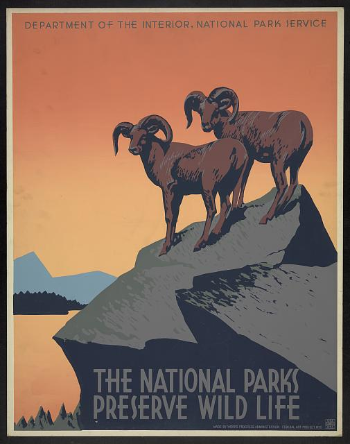

The theme's short codes in action. See my shortcode repository at
https://github.com/parsiya/Hugo-Shortcodes for more.

<!--more-->

# Table of Content
Use the short code to put it anywhere in the page like this:

```
{{ < toc > }}
```

If you are using Goldmark, you need to change the start and end level headings
in the config file. The defaults are level 2 and 3 respectively.

``` toml
[markup]
  [markup.tableOfContents]
    endLevel = 8
    startLevel = 1
```

Please see more at
[https://gohugo.io/getting-started/configuration-markup/#table-of-contents][toc-config].

[toc-config]: https://gohugo.io/getting-started/configuration-markup/#table-of-contents

The table of contents for this page:



# Codecaption

**Python**


from base64 import b64encode
from binascii import unhexlify

print b64encode(unhexlify("0a0b0c0d"))
CgsMDQ==


Using a codefence (` ``` `):

```python
from base64 import b64encode
from binascii import unhexlify

print b64encode(unhexlify("0a0b0c0d"))
CgsMDQ==
```

Using the Hugo internal `highlight` shortcode:


from base64 import b64encode
from binascii import unhexlify

print b64encode(unhexlify("0a0b0c0d"))
CgsMDQ==


Using an indented code block (no highlighting):

	from base64 import b64encode
	from binascii import unhexlify

	print b64encode(unhexlify("0a0b0c0d"))
	CgsMDQ==

In a Github gist:



**Go**


package main

import (
	"fmt"
)

func main() {
	fmt.Println("Hello World")
}


**Powershell**


# notepad does not have an entry
$ Test-Path "HKLM:\SOFTWARE\Microsoft\Windows\CurrentVersion\App Paths\notepad.exe"
False
# chrome does
$ Test-Path "HKLM:\SOFTWARE\Microsoft\Windows\CurrentVersion\App Paths\chrome.exe"
True


# imgcap


Image is named `The national parks preserve wild life`. Acquired from the
Library of Congress' "Free to Use and Reuse: Work Projects Administration (WPA)
Posters" collection at https://www.loc.gov/item/98518597/.

The same image using the markdown image tag.


